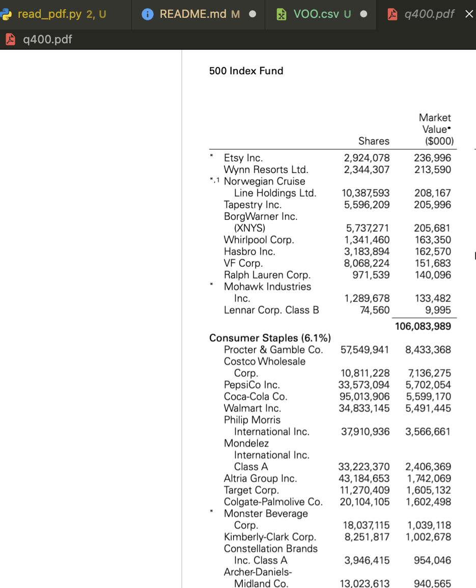
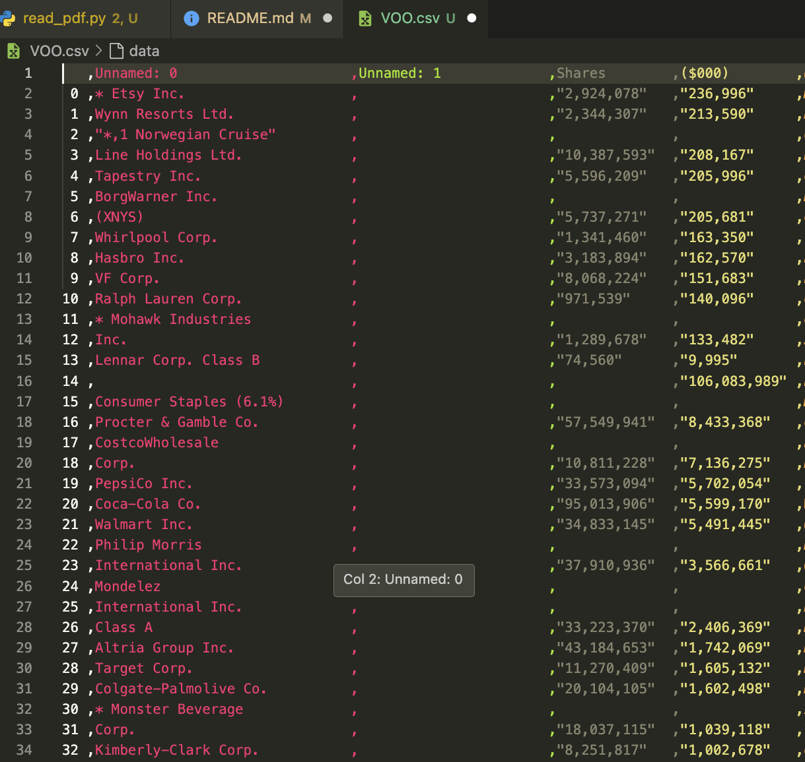

## 📝 Table of Contents

- [About](#about)
- [Getting Started](#getting_started)
- [Deployment](#deployment)
- [Usage](#usage)
- [Authors](#authors)


## 🧐 About <a name = "about"></a>

Testing tabula-py for reading pdf to obtain info from tables in the text. A short introduction of the use of this library

## 🏁 Getting Started <a name = "getting_started"></a>

These instructions will get you a copy of the project up and running on your local machine for development and testing purposes. See [deployment](#deployment) for notes on how to deploy the project on a live system.

### Prerequisites

First of all you need to create a virtual environment, on other case with your global python.

Steps to create virtual environment

```
python3 -m venv venv
source venv/bin/activate
```

Also you will need JAVA 8+. Follow the official site for further info. https://tabula-py.readthedocs.io/en/latest/getting_started.html#requirements

Required Libraries
```
pip install tabula-py
pip install pandas
```


## 🔧 Running the tests <a name = "tests"></a>

To run you only need a PDf file with some tables in there. In this example I get information from VOO ETF.

```
python3 src/read_pdf.py 
```
With pandas I write a csv to see the resultas

PDF File info:



Below there are the result of reading pdfs




## 🎈 Usage <a name="usage"></a>

If you need to get some information from pdf files an there are a lot of tables is a good option to get data to then use it for analysis.


## ✍️ Authors <a name = "authors"></a>

- [@sgnclexus](https://github.com/sgnclexus) - Idea & Initial work


